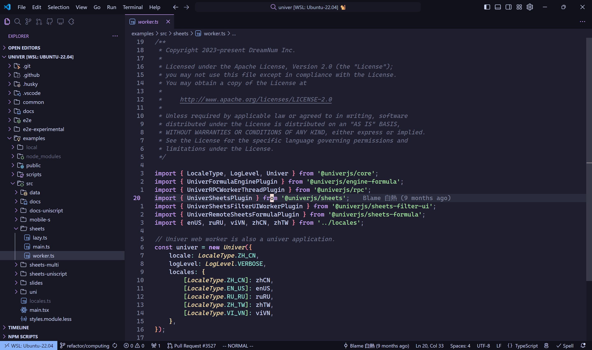

# dotfiles



An efficient development environment for _practical minimalists_. Read about [Tools](https://wzhu.dev/tools).

* Editors: VSCode in vim mode, vim
* Languages: Node.js (based on fnm), Rust, Go
* TUI tools: homebrew, oh-my-zsh, starship, fzf, lazygit, gh

## Setup

Run the following command in your home directory.

```sh
cd $HOME
```

### Install zsh and plugins

Install oh-my-zsh and plugins.

```sh
# perhaps should install zsh first on Linux
# WSL
sudo apt install zsh

sh -c "$(curl -fsSL https://raw.github.com/ohmyzsh/ohmyzsh/master/tools/install.sh)"

# install zsh plugins
git clone https://github.com/zsh-users/zsh-autosuggestions ${ZSH_CUSTOM:-~/.oh-my-zsh/custom}/plugins/zsh-autosuggestions
git clone https://github.com/zsh-users/zsh-syntax-highlighting.git ${ZSH_CUSTOM:-~/.oh-my-zsh/custom}/plugins/zsh-syntax-highlighting
```

### Install homebrew and dependencies

Install Homebrew:

```sh
/bin/bash -c "$(curl -fsSL https://raw.githubusercontent.com/Homebrew/install/HEAD/install.sh)"
```

Install packages with Homebrew:

```sh
# install TUI applications
brew install fzf fnm rustup-init git lazygit cloc tree gh starship 
```

### Download dotfiles and link

Clone the project and link configuration files:

```sh
# download dotfiles
git clone https://github.com/wzhudev/d.git .dotfiles

# make config dir if necessary
mkdir .config

# link dotfiles
ln -fs ~/.dotfiles/.zshrc ~/.zshrc
ln -fs ~/.dotfiles/.vimrc ~/.vimrc
ln -fs ~/.dotfiles/config/starship.toml ~/.config/starship.toml

cp ~/.dotfiles/.gitconfig .gitconfig

source ~/.zshrc
```

## Post setup

### SSH

Generate a ssh key and add the pub key to GitHub:

```sh
# generate ssh-key
ssh-keygen

# get pub key
cat ~/.ssh/id_rsa.pub
```

Add then paste content of `./config/ssh` to `~/.ssh/config`:

```sh
cp ~/.dotfiles/config/ssh ~/.ssh/config
```

### Setup Node.js

Run `fnm env` and paste the outcomes to `./dotfiles/unsync/init.sh` to set Node.js environment.

## Per-platform

Read the following instructions for your platform:

* [Windows.md](./README-windows.md) for Windows & WSL.
* [macOS.md](./README-mac.md) for macOS.

## Unsync

Put things under folder .unsync if I do not want to sync it across my devices. Use `unsync/init.sh` as the entrance file name.

## Miscellaneous

Run the following command to set proxy if necessary.

```sh
export ALL_PROXY="http://127.0.0.1:7890"
export HTTPS_PROXY="http://127.0.0.1:7890"
export HTTP_PROXY="http://127.0.0.1:7890"
```
