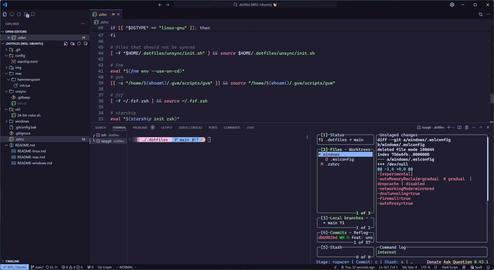

# dotfiles

> Set up a new Mac / WSL dev environment with CLI tools, Application and settings.

## Showcase




## Prepare

* [Fenghost](https://fenghost.net/) when in Mainland China
* [Visual Studio Code](https://code.visualstudio.com/)

## Setup

Do these in my home directory.

```sh
cd $HOME
```

Set proxy first when in Mainland China.

```sh
# macOS
export ALL_PROXY="http://127.0.0.1:7890"
export HTTPS_PROXY="http://127.0.0.1:7890"
export HTTP_PROXY="http://127.0.0.1:7890"

# WSL
host_ip=$(cat /etc/resolv.conf | grep "nameserver" | cut -f 2 -d " ")
export ALL_PROXY="http://$host_ip:7890"
export HTTP_PROXY="http://$host_ip:7890"
export HTTPS_PROXY="http://$host_ip:7890"
```

Install oh-my-zsh and plugins.

```sh
# perhaps should install zsh first on Linux
# WSL
sudo apt install zsh

sh -c "$(curl -fsSL https://raw.github.com/ohmyzsh/ohmyzsh/master/tools/install.sh)"

# install zsh plugins
git clone https://github.com/zsh-users/zsh-autosuggestions ${ZSH_CUSTOM:-~/.oh-my-zsh/custom}/plugins/zsh-autosuggestions
git clone https://github.com/zsh-users/zsh-syntax-highlighting.git ${ZSH_CUSTOM:-~/.oh-my-zsh/custom}/plugins/zsh-syntax-highlighting
```

Install Homebrew:

```sh
/bin/bash -c "$(curl -fsSL https://raw.githubusercontent.com/Homebrew/install/HEAD/install.sh)"
```

Install packages with Homebrew:

```sh
# install CLI utils
brew install fzf fnm rustup-init git go lazygit tmux neovim ripgrep fd cloc tree bat gh starship btop bat zellij

# macOS only
brew install --cask visual-studio-code raycast hammerspoon google-chrome
```

Generate a ssh key and add the pub key to GitHub:

```sh
# generate ssh-key
ssh-keygen

# get pub key
cat ~/.ssh/id_rsa.pub
```

Clone the project and link configuration files:

```sh
# download dotfiles
git clone git@github.com:wzhudev/d.git .dotfiles

# link dotfiles
ln -fs ~/.dotfiles/.zshrc ~/.zshrc
ln -fs ~/.dotfiles/.gitconfig ~/.gitconfig
ln -fs ~/.dotfiles/.vimrc ~/.vimrc
ln -fs ~/.dotfiles/.tmux.conf ~/.tmux.conf
ln -fs ~/.dotfiles/config/nvim ~/.config/nvim
ln -fs ~/.dotfiles/config/zellij ~/.config/zellij

# macOS only
ln -fs ~/.dotfiles/mac/hammerspoon/init.lua ~/.hammerspoon/init.lua

source ~/.zshrc
```

## Unsync

Put things under folder .unsync if I do not want to sync it across my devices. Use `unsync/init.sh` as the entrance file name.
